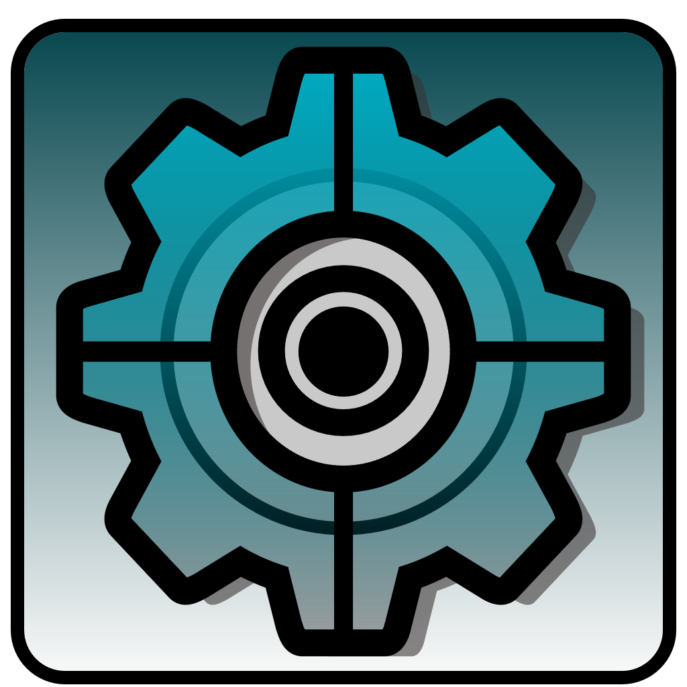
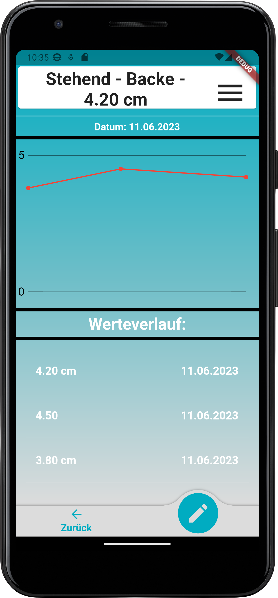
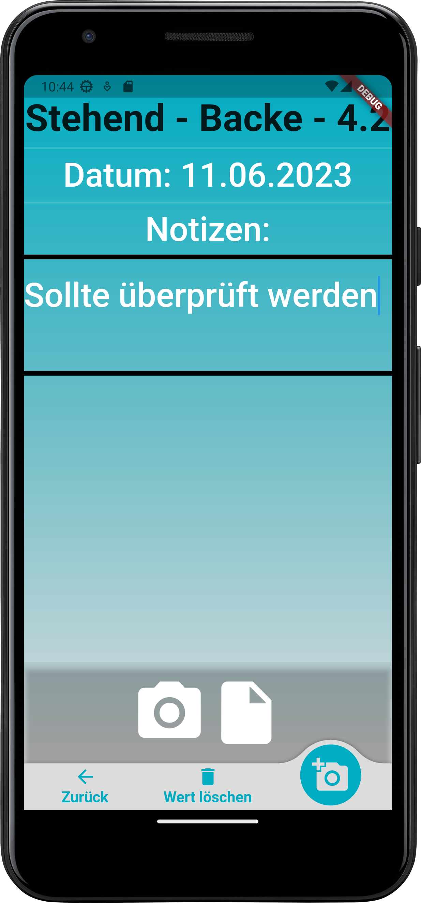

# Shooting Device Assistant (Android/iOS)

An app to appropriately document your shooting settings. 
Store the settings of your air rifle, air pistol, smallbore rifle or whatever in a well organized manner to have them always available with you. 
*This app is exclusively designed for usage in the context of [(Olympic) Sports Shooting](https://en.wikipedia.org/wiki/Shooting_sports). Other use
is not intended or encouraged.*

## Features

Get an **overview** of all the values for a specific setting over time:

See *Notes* or *Pictures* for the entry:

Get help to document all your settings with predefined setting **wizards**:

Copy your current settings to do some experimental adjustments without losing the old configuration. Or simply adjust
the settings for a different range:

**Languages supported at the moment: English, German**

## Contact / Contribute / Donate

Do you have any questions/suggestions/critique or do you want to participate in testing? Feel free to create an issue
or get in touch via the contact forms provided in the app!

If you want to contribute you can create a pull request and should you want to post a suggestion or report a bug you can also create an issue.

The app is completely free and does not show any ads. Do you want to support the app financially? Feel free to use the link below:

